# Projekt 1

Celem tego projektu jest znalezienie jak najlepszego rozwiązania gry Fill-a-pix za pomocą algorytmu genetycznego jak i optymalizacji poprzez rój. Fill-a-pix to gra podobna do sapera polegająca na zamalowaniu odpowiedniej liczby kratek wokół pola o danej liczbie. W projekcie porównymane będą czasy działania oraz skuteczność każdej z metod na danych o różnej wielkości.

## Macierz 5x5

### Algorytm genetyczny

Na początku badamy algorytm na macierzy 5x5. Gene_space składa się z 0 i 1 reprezentujących odpowiedniu białe i czarne pola. Liczba genów jest równa ilości pól w macierzy czyli 25. Przez to, że elementów jest tak mało, algorytm bardzo dobrze sobie z nim radzi i nie widać dużych różnic przy zmianie parametrów funkcji pygad.GA. We większych macierzach będzie to znacznie lepiej widoczne.
Funkcja fitness prezentuje się następująco:  
```
def fitness_func(solution, solution_idx):
    
    x = 0
    y = 0
    punish = 0
    
    for k in range(len(solution)):
        pos = fruits[x][y]
        if pos>=0:
            if x == 0 and y == 0:
                counter=0
                for i in range(x,x+2):
                    for j in range(y,y+2):
                        if solution[i*len(fruits[0]) + j] == 1:
                            counter+=1
                punish+=numpy.abs(pos-counter)
                y+=1
                #czy krawedz y
            if x == 0 and y == len(fruits[0])-1:
                counter=0
                for i in range(x,x+2):
                    for j in range(y-1,y+1):
                        if solution[i*len(fruits[0]) + j] == 1:
                            counter+=1
                punish+=numpy.abs(pos-counter)
                x+=1
                y=0
            if x == len(fruits[0])-1 and y == 0:
                counter=0
                for i in range(x-1,x+1):
                    for j in range(y,y+2):
                        if solution[i*len(fruits[0]) + j] == 1:
                            counter+=1
                punish+=numpy.abs(pos-counter)
                y+=1
            if x == 0 and 0<y<len(fruits[0])-1:
                counter=0
                for i in range(x,x+2):
                    for j in range(y-1,y+2):
                        if solution[i*len(fruits[0]) + j] == 1:
                            counter+=1
                punish+=numpy.abs(pos-counter)
                y+=1
            if x == len(fruits[0])-1 and 0<y<len(fruits[0])-1:
                counter=0
                for i in range(x-1,x+1):
                    for j in range(y-1,y+2):
                        if solution[i*len(fruits[0]) + j] == 1:
                            counter+=1
                punish+=numpy.abs(pos-counter)
                y+=1
            if y == 0 and 0<x<len(fruits[0])-1:
                counter=0
                for i in range(x-1,x+2):
                    for j in range(y,y+2):
                        if solution[i*len(fruits[0]) + j] == 1:
                            counter+=1
                punish+=numpy.abs(pos-counter)
                y+=1
            if y == len(fruits[0])-1 and 0<x<len(fruits[0])-1:
                counter=0
                for i in range(x-1,x+2):
                    for j in range(y-1,y+1):
                        if solution[i*len(fruits[0]) + j] == 1:
                            counter+=1
                punish+=numpy.abs(pos-counter)
                x+=1
                y=0
            if x == len(fruits[0])-1 and y == len(fruits[0])-1:
                counter=0
                for i in range(x-1,x+1):
                    for j in range(y-1,y+1):
                        if solution[i*len(fruits[0]) + j] == 1:
                            counter+=1
                punish+=numpy.abs(pos-counter)
                break
                #koniec
            if (len(fruits[0])-1>x>0 and len(fruits[0])-1>y>0):
                counter=0
                for i in range(x-1,x+2):
                    for j in range(y-1,y+2):
                        if solution[i*len(fruits[0]) + j] == 1:
                            counter+=1
                punish+=numpy.abs(pos-counter)
                y+=1
        else:
            if y==len(fruits[0])-1:
                if x==len(fruits[0])-1:
                    break
                else:
                    x+=1
                    y=0
            else:
                y+=1
        
            

    fitness = -(numpy.abs(punish))
    return fitness
```
Działanie funkcji polega na iteracji po elementach macierzy. W przypadku napotkania liczby większej od -1, zliczane są wystąpienia wartości 1 w tablicy solution wokół indeksu danej liczby. Po zliczeniu przyznawane są punkty karne w ilości wartości absolutnej (wartość liczby - wystąpienia "1"). Jak można zauważyć, większa część funkci fitness to warunki pinujące, aby indeksy wokół liczby nie wyszły poza skalę. Spośród różnych wersji funkcji fitness to ta okazała się najdokładniejsza ze względu na spory zakres odstępstwa rezultatu najgorszego od idealnego (liczba p. karnych).

Liczba chromosomów: 200, generacje: 600, szansa mutacji: 2%  
Przebieg rozwiązania wraz z rezultatem:

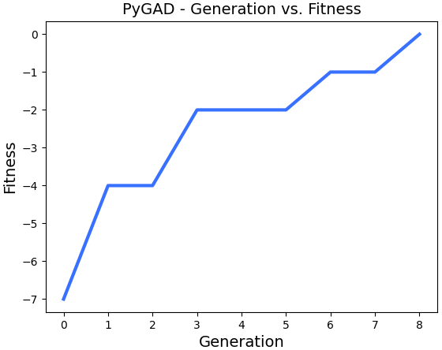  
```
0.18
Parameters of the best solution : [0. 1. 1. 0. 0. 1. 1. 1. 0. 1. 0. 0. 1. 1. 1. 0. 0. 1. 1. 1. 0. 0. 0. 1.
 0.]
Fitness value of the best solution = 0
```
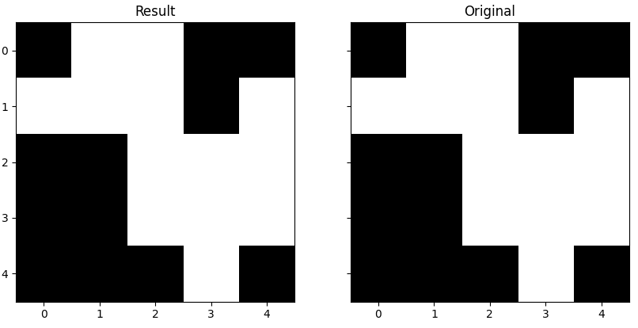  
### Rój
W algorytmie roju raz jeszcze wykorzystywana jest funkcja fitness. Tym razem podczas eksperymentowania przy parametrach funkcji BinaryPSO można zauważyć pewne zależności. Im mniejsze warości c1 i c2 (cogintive i social parameter) w options tym szybciej algorytm znajduje rozwiązanie. Tak samo przy zwiększaniu współczynnika bezwładności (w).  
Najepszy wynik:

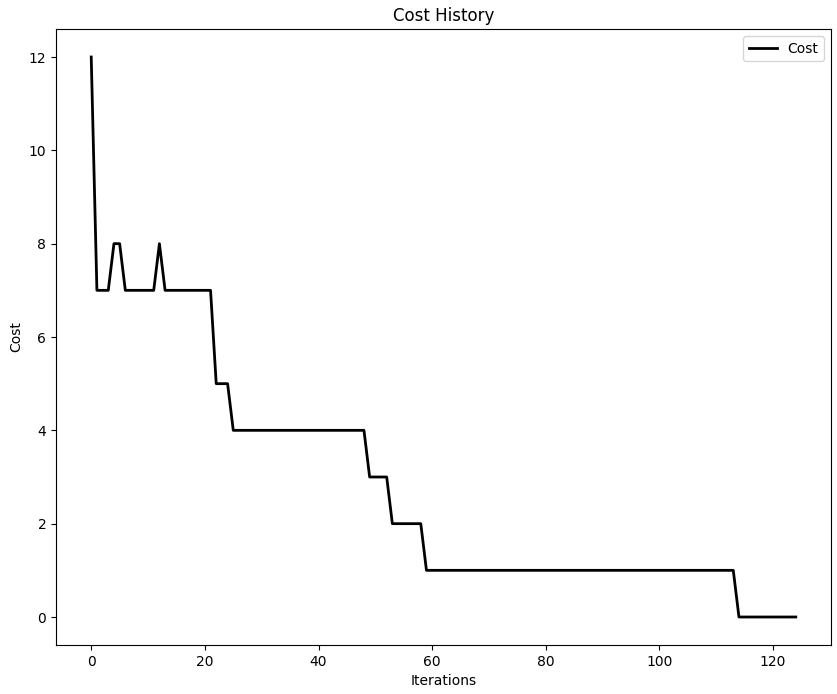 

Porównanie najlepszych wyników dla różnych wartości parametrów zmiennej options:

```
2022-04-22 22:14:57,151 - Optimize for 125 iters with {'c1': 0.2, 'c2': 0.1, 'w': 1, 'k': 2, 'p': 1}
2022-04-22 22:14:57,467 - Optimization finished | best cost: 0.0, best pos: [0 1 1 0 0 1 1 1 0 1 0 0 1 1 1 0 0 1 1 1 0 0 0 1 0]
```

```
2022-04-23 00:04:18,596 - Optimize for 125 iters with {'c1': 0.5, 'c2': 0.3, 'w': 0.9, 'k': 2, 'p': 1}
2022-04-23 00:04:18,899 - Optimization finished | best cost: 2.0, best pos: [1 0 1 0 0 1 1 1 1 0 0 0 0 1 1 1 0 1 1 1 0 0 0 1 0]
```

Dodatkowo na około 20 prób dla każdego z wariantu, wyniki wariantu {'c1': 0.2, 'c2': 0.1, 'w': 1, 'k': 2, 'p': 1} oscylowały w przedziale 0-1 podczas gdy dla wariantu {'c1': 0.5, 'c2': 0.3, 'w': 0.9, 'k': 2, 'p': 1} w przedziale 2-4.  
### Wnioski
Podsumowując, oba algorytmy bardzo sprawnie rozwiązują macierz. Średni czas uzyskany z 20 prób w bou przypadkach osyuje w granicy 0.4-0.5s z niewielką przewagą w najlepszych czasach dla algorytmu genetycznego. Dodatkowo dzięki eksperymentom może się okazać, że już odkryliśmy najlepsze wartości zmiennej options. To trzeba będzie sprawdzić w następnych etapach na większej macierzy.

## Macierz 10x10
### Algorytm genetyczny
Liczba chromosomów: 200, generacje: 6000, szansa mutacji: 2%  
Najlepszy wynik:

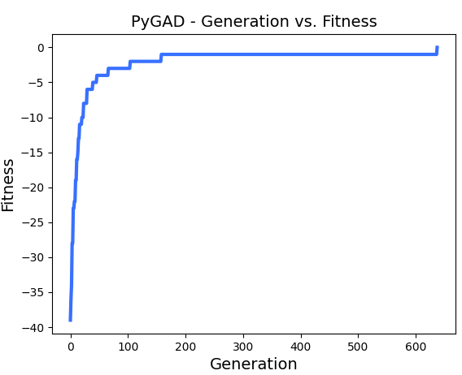
```
442.228
Parameters of the best solution : [0. 1. 1. 0. 0. 0. 0. 0. 1. 1. 0. 0. 0. 1. 0. 0. 0. 1. 1. 1. 0. 0. 1. 1.
1. 0. 0. 1. 1. 1. 0. 1. 1. 0. 1. 1. 0. 1. 0. 0. 0. 1. 0. 0. 0. 1. 1. 1.
1. 0. 1. 1. 0. 0. 1. 1. 0. 0. 1. 1. 1. 0. 0. 0. 1. 0. 0. 0. 0. 1. 1. 0.
0. 0. 1. 0. 0. 0. 0. 1. 1. 1. 0. 0. 1. 1. 0. 0. 1. 1. 0. 1. 1. 1. 1. 1.
1. 1. 1. 0.]
Fitness value of the best solution = 0
```
Najlepszy czas dla algorytmu genetycznego wyniósł nieco ponad 7 minut i dał prawidłowe rozwiązanie:

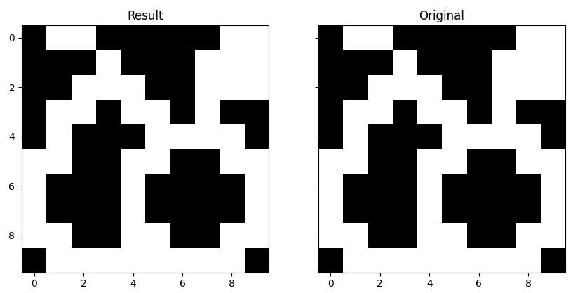

Średni czas z 10 prób wyniósł nieco ponad 10 minut. Algorytm ten sprawnie i z powodzeniem znajduje rozwiązania. Potrzebuje średnio 2 minuty aby wyznaczyć rozwiązanie z pojedyńczym błędem. Przez kolejne 5-10 min dochodzi do właściwego rozwiązania. Aby wyznaczyć rozwiązanie z pojedyńczym błędem algorytm musi działać przez co najmniej minutę. 

Dla porównania, przy zastosowaniu taktyki z zabijaniem błędnych solution, algorytm w najlepszym przypadku zbliżył się do rozwiązania z 34 punktami karnymi.  

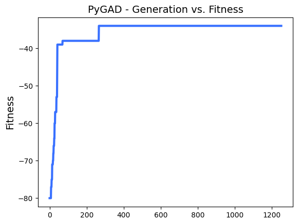

```
494.834
Parameters of the best solution : [0. 0. 1. 1. 0. 0. 0. 0. 1. 1. 0. 0. 1. 0. 0. 0. 0. 1. 1. 1. 1. 0. 1. 1.
1. 0. 0. 1. 1. 1. 0. 1. 0. 1. 1. 1. 0. 1. 0. 0. 0. 1. 0. 0. 0. 1. 1. 1.
1. 0. 1. 1. 0. 0. 1. 0. 0. 1. 1. 1. 1. 0. 0. 0. 1. 1. 0. 0. 1. 1. 1. 0.
0. 0. 0. 0. 1. 1. 0. 1. 1. 1. 1. 1. 0. 0. 0. 0. 0. 1. 0. 1. 0. 0. 1. 1.
1. 0. 0. 0.]
Fitness value of the best solution = -34
```

Liczba chromosomów: 200, generacje: 600, szansa mutacji: 2%  
Best solution = -1 w minutę:

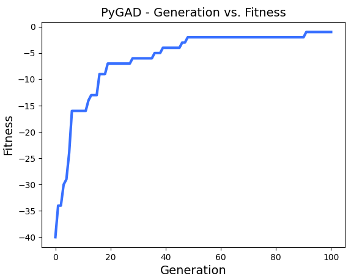

```
60.312
Parameters of the best solution : [0. 0. 0. 0. 0. 0. 0. 0. 1. 1. 0. 1. 1. 1. 0. 0. 0. 1. 1. 1. 0. 0. 0. 1.
 1. 0. 0. 1. 1. 1. 1. 0. 1. 0. 1. 1. 0. 1. 0. 0. 1. 1. 0. 1. 0. 1. 1. 1.
 1. 0. 1. 1. 0. 0. 0. 1. 0. 0. 1. 1. 1. 0. 0. 0. 1. 0. 0. 0. 0. 1. 1. 0.
 0. 0. 1. 0. 0. 0. 0. 1. 1. 1. 0. 0. 1. 1. 0. 0. 1. 1. 0. 1. 1. 1. 1. 1.
 1. 1. 1. 0.]
Fitness value of the best solution = -1
```

### Rój
Najlepszy wynik:

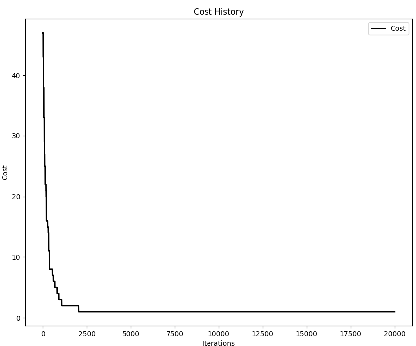
```
2022-04-23 22:21:02,844 - Optimize for 20000 iters with {'c1': 0.2, 'c2': 0.1, 'w': 1, 'k': 9, 'p': 1}
2022-04-23 22:32:27,248 - pyswarms.discrete.binary - INFO - Optimization finished | best cost: 1.0, best pos: [0 0 1 1 0 0 0 0 1 1 1 0 0 1 0 0 0 1 1 1 0 1 1 0 1 0 0 1 1 1 0 1 0 1 1 1 0
1 0 0 0 0 1 0 0 1 1 1 1 0 1 1 0 0 0 1 0 0 1 1 1 0 0 0 1 0 0 0 0 1 1 0 0 0
1 0 0 0 0 1 1 1 0 0 1 1 0 0 1 1 0 1 1 1 1 1 1 1 1 0]
```

Algorytm ten znacznie szybciej od genetycznego znajduje odpowiedź z pojedynczy błędem - zajmuje mu to około 30 sekund jednak bardzo problematyczne okazało się dla niego znalezienie właściwej odpowiedzi. Z pośród 10 prób po 10 min na 20000 iteracjach, ani razu nie udało się rozwiązać łamigłówki. Wynik funkcji (best_cost) oscylował w granicy 1-3 ze średnią równą 2. Potwiedziła się teoria z wartościami współczynników, dla macierzy 10x10 znacznie szybciej odnajdywane jest rozwiązanie z c1=0.2 i c2=0.1. Współczynnik bezwładności okazał się mieć kluczowe znaczenie i powinien wynosić jak najwięcej (maksymalnie 1).

Best_cost=1 w 30 sekund:

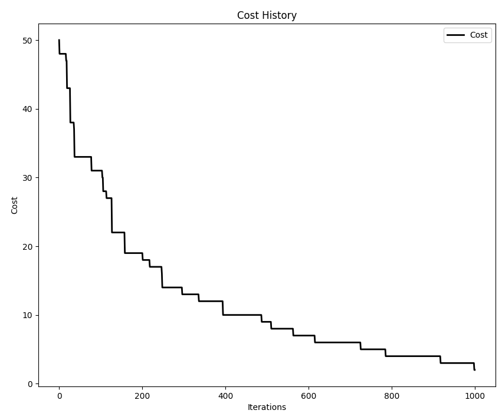
```
2022-04-25 21:22:20,224 - Optimize for 20000 iters with {'c1': 0.2, 'c2': 0.1, 'w': 1, 'k': 9, 'p': 1}
2022-04-25 21:31:02,920 - INFO - Optimization finished | best cost: 1.0, best pos: [0 0 1 1 0 0 0 0 1 1 0 0 1 0 0 0 0 1 1 1 1 0 0 1 1 0 0 1 1 1 1 1 1 1 1 1 0 
1 0 0 0 0 0 0 0 1 1 1 1 0 1 1 0 0 1 0 1 0 0 1 1 0 0 0 1 0 0 0 0 1 1 0 0 0 
1 0 0 0 0 1 1 1 0 0 1 1 0 0 1 1 0 1 1 1 1 1 1 1 1 0]
```

### Wnioski
Podsumowując, jedynie algorymowi genetycznemu udało się rozwiązać macierz 10x10 w ciągu 10 minut. Z drugiej strony rój dał radę zbliżyć się do etapu gdzie jest o krok (1 pkt. karny) od prawidłowego rozwiązania w zaledwie 30 sekund, kiedy algorytmowi zajęło to ponad minutę. 

## Macierz 15x15

### Algorytm genetyczny
Liczba chromosomów: 200, generacje: 600, szansa mutacji: 2%  
Najlepszy wynik w ciągu 1min wyniósł -26, średni wynik około -28:

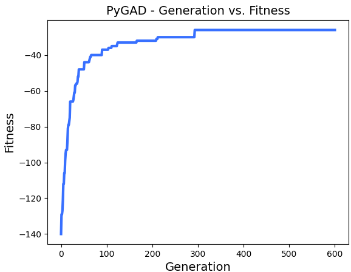

Liczba chromosomów: 200, generacje: 6000, szansa mutacji: 2%  
Najlepszy wynik w ciągu 10min wyniósł -17, średni wynik około -22:

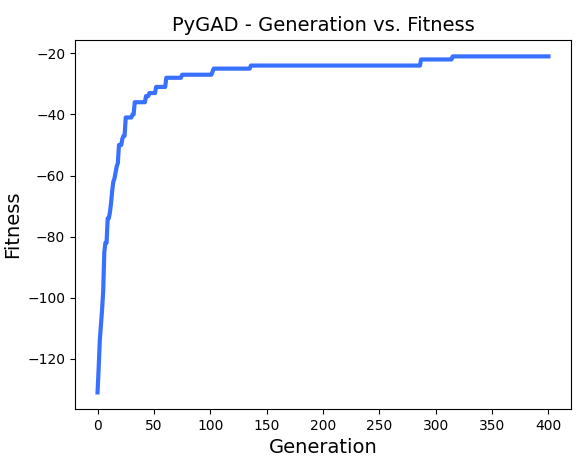

Otrzymane rozwiązanie:

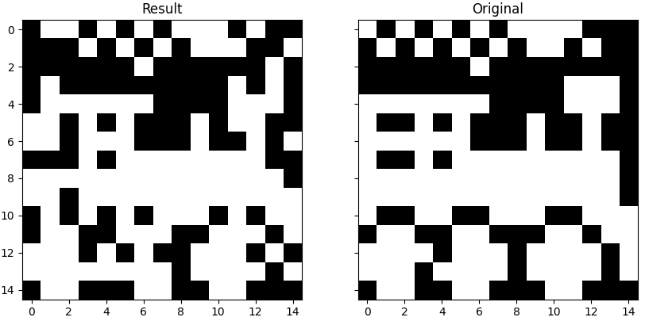

Dla porównania, działanie tego samego algorytmu z parametrami: 2000 chromosomów, 60 i 600 generacji dawało średnio o 10-15% gorsze rozwiązanie

### Rój
Stosujemy sprawdzone wartości options: {'c1': 0.2, 'c2': 0.1, 'w': 1, 'k': 2, 'p': 1}

Najlepszy wynik w ciągu 1min wyniósł 49, średni wynik około 53:

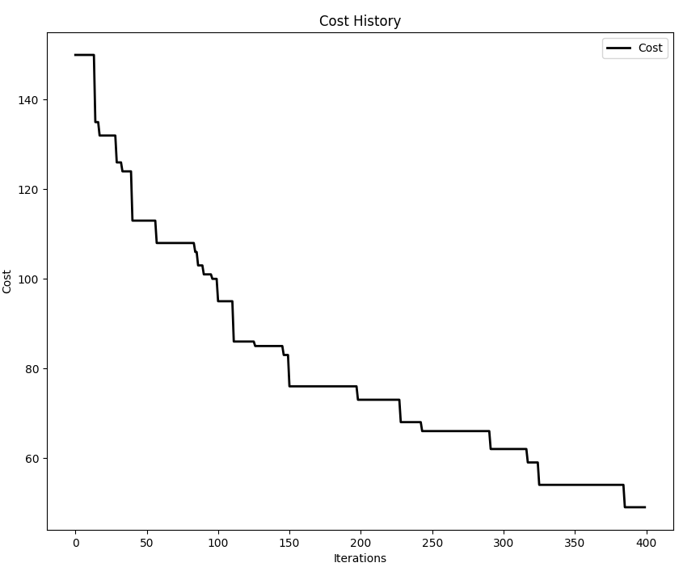

Najlepszy wynik w ciągu 10min wyniósł 16, średni wynik około 18:

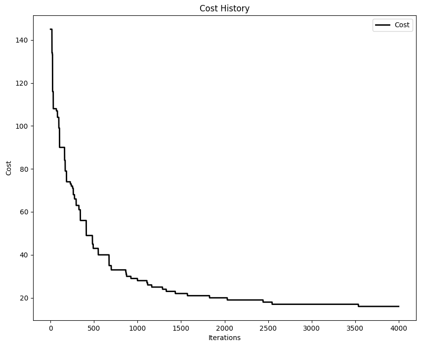

### Wnioski
Oba algorytmy nie poradziły sobie z macierzą 15x15 w czasie poniżej 10 min. Chociaż w ciągu minuty algorym genetyczny wyznaczał dwa razy lepsze rozwiązanie od roju, to ostatecznie w 10 minut był w stanie osiągnąć lepszy wynik ze znacznie wyższą powtażalnością (min. wynik bliski średniej).  

## Podsumowanie
Algorymt genetyczny okazał się znacznie lepszy od roju w kategoriach: macierz 5x5, macierz 10x10 do 10 minut, macierz 15x15 do 1 minuty. Można przyjąć, że to on będzie najlepszym wyborem do wyliczenia konkretnego rozwiązania macierzy w przedziale 5x5-10x10. Głównie z uwagi na to że dla macierzy 10x10 jako jedyny, 3-krotnie znalazł rozwiązanie, podczas gdy rój nie zdołał ani razu. Z drugiej strony im macierz większa niż 10x10, tym lepiej wypada rój, który powoli, ale bardzo systematycznie zbliża się do właściwej odpowiedzi. Może mieć on jednak problem z wyznaczeniem dokładnego rozwiązania, jak mogliśmy obserwować w przypadku macierzy 10x10.